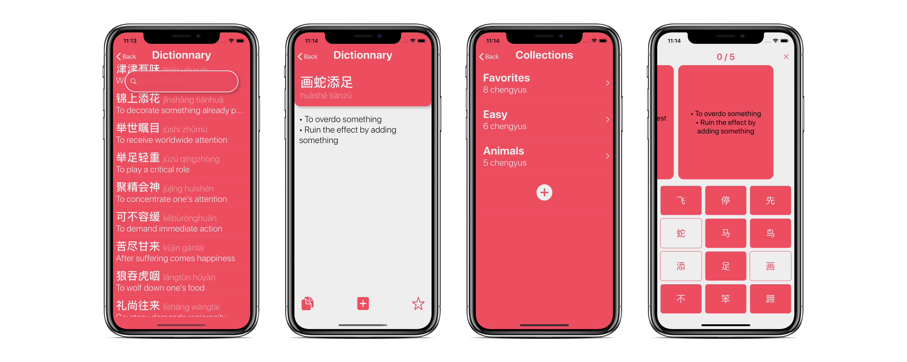

# MyChengyu

MyChengyu helps you learn Chinese idioms, called chengyus, which are most of the time a combination of four characters. They are a big part of the Chinese culture and anyone willing to speak chinese must be familiar with them.

# Upcoming features
- Character type choice (Traditional - Simplified) ✅
- French language localization
- Menu UI refactoring
- Widgets
- Flashcards
_ Apple watch extension
